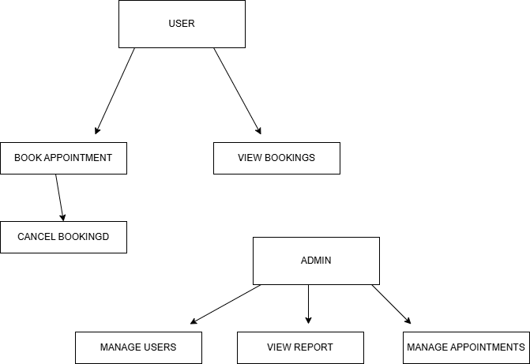

# Requirement Analysis in Software Development

**This is ALX Pro-Dev Frontend development Task**

# What is Requirement Analysis?
Requirement Analysis is a fundamental phase in the Software Development Lifecycle (SDLC) that involves gathering, analyzing, and defining the needs and expectations of stakeholders for a new or modified software system. It serves as the blueprint for what the system must achieve and guides all future stages of development, including design, implementation, testing, and maintenance.

**Why is Requirement Analysis Important?**

Requirement Analysis is critical because it ensures that:

 The development team and stakeholders have a shared understanding of the software goals.

 Developers build the right product, not just build the product right.

 Potential issues, ambiguities, and risks are identified early, reducing costly changes later in the project.

 Functional and non-functional requirements (like performance, security, and usability) are clearly defined.

 **Key Activities in Requirement Analysis**

Requirement Elicitation
Gathering information from stakeholders through interviews, surveys, observation, etc.

Requirement Specification
Documenting the requirements in a clear, consistent, and unambiguous manner (e.g., in a Software Requirements Specification – SRS).

Requirement Validation
Ensuring the documented requirements are correct, complete, and aligned with stakeholder needs.

Requirement Management
Handling changes to the requirements throughout the project lifecycle.

# Why is Requirement Analysis Important?

**Prevents Miscommunication**
It ensures all stakeholders and developers have a clear, shared understanding of what the software should do.

**Reduces Cost and Rework**
Identifying and fixing issues early in the planning phase is far cheaper than during development or after release.

**Improves Project Success**
Well-defined requirements help teams stay on track, deliver on time, and meet user expectations.

# Key Activities in Requirement Analysis
**Requirement Gathering:** Collecting initial needs from stakeholders and users.

**Requirement Elicitation:** Engaging with stakeholders to uncover hidden or unclear needs.

**Requirement Documentation:** Writing down the requirements clearly for reference and communication.

**Requirement Analysis and Modeling:** Organizing and refining requirements using models or diagrams.

**Requirement Validation:** Checking that requirements are complete, correct, and aligned with project goals.

## Types of Requirements

###  Functional Requirements

**Definition:**  
Functional requirements describe **what the system should do** — the specific tasks, features, or operations the software must perform.

**Examples (Booking Management System):**
- Users can **create**, **view**, **update**, and **cancel** bookings.
- The system sends **confirmation emails** upon successful bookings.
- Admins can **manage user accounts** and **generate booking reports**.
- Users can **search for available slots** based on date and location.

---

### Non-functional Requirements

**Definition:**  
Non-functional requirements define **how the system performs** — focusing on quality attributes like performance, security, and usability.

**Examples (Booking Management System):**
- The system should respond to user actions **within 2 seconds**.
- All booking data must be **encrypted** during transmission.
- The system should maintain **99.9% uptime** throughout the year.
- The user interface must be **accessible** to users with visual impairments.

  ## Use Case Diagrams
**What is a Use Case Diagram?**  
Use Case Diagrams are part of the Unified Modeling Language (UML) and are used in **requirement analysis** to visually represent how users (actors) interact with a system. They help identify the system’s functionality and the different user roles involved.

### 🔍 Benefits of Use Case Diagrams:
- Clarify system functionality and scope.
- Improve communication between stakeholders and developers.
- Identify all possible user interactions early in the SDLC.
- Aid in designing test cases and validating requirements.

---

### Booking System – Use Case Diagram

## ✅ Acceptance Criteria

### 📌 What is Acceptance Criteria?

**Acceptance Criteria** are predefined conditions that a software product or feature must meet to be accepted by users, stakeholders, or the product owner. They are written from the user’s perspective and serve as a benchmark to validate whether a feature works as intended.

### 🎯 Why is Acceptance Criteria Important?

- Ensures the development team **understands the exact expectations**.
- Reduces **ambiguity** in feature implementation.
- Helps with **testing and validation** — each criterion can become a test case.
- Aligns the team on **“done”** for a feature.

---

### 💡 Example: Checkout Feature in Booking Management System

**Feature:** Checkout after booking selection

**Acceptance Criteria:**
- User must be able to review their booking summary before confirming.
- The total cost is calculated accurately, including applicable taxes or fees.
- User can apply a valid promo code and see the updated total.
- System displays a success message upon successful payment.
- A confirmation email is sent to the user after checkout.
- Checkout fails gracefully if payment is declined, with an appropriate error message.

---

These criteria ensure that the Checkout feature works smoothly and meets both business and user needs.
